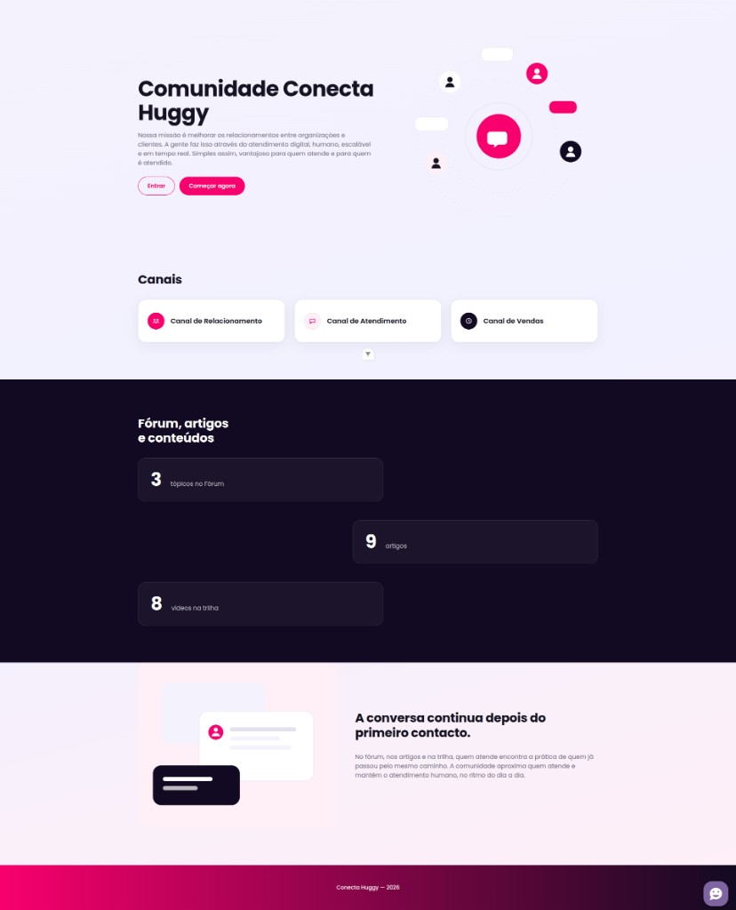

# Conecta Huggy

Interface em Vue 3, TypeScript, Vite e Pinia. O ecrã lê a API em `http://127.0.0.1:8085/api`.

## Layout

Landing em `/guest`.



## Subir

Na raiz do repositório:

```bash
make up
```

O ecrã fica em http://localhost:5173. A API sobe junto, na porta 8085.

## O que a tela faz

As stores em `src/stores` chamam as rotas que já existiam e leem o miolo `data` do envelope (`data`, `message`, `code`, `status_code`, `errors`).

| Store | Pedido |
| --- | --- |
| `segmentStore` | `GET /api/segments` |
| `articleStore` | `GET /api/articles` |
| `topicStore` | `GET /api/topics` |
| `authStore` | `POST /api/login` |
| `userStore` | `POST /api/user`, `GET /api/user`, `PUT /api/user/preference` |

O artigo expõe `author_name`. O tópico expõe `author_name` e `category_name`. O utilizador expõe `is_subscribed` e `segment_ids`. O endereço da API está em `src/router/client.ts`.

Os testes das stores rodam com `npm test` dentro de `frontend`, ou no contentor:

```bash
docker compose exec frontend npm test -- --run
```
